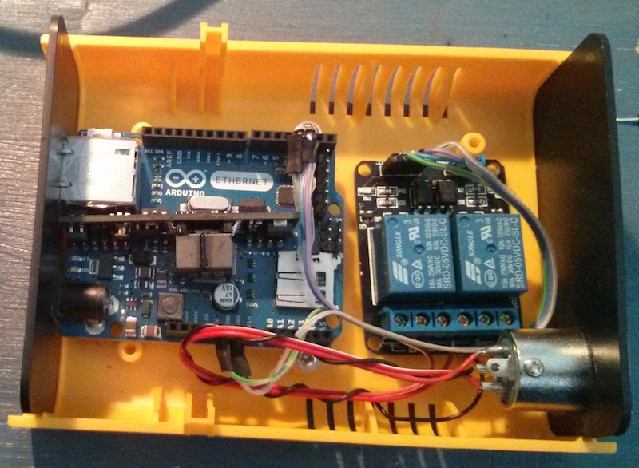

# Window opener
Opens our rooftop window in the berlin office.

This is a pretty basic arduino script, used by an Arduino Ethernet with POE and a [5V 2 Channel Relay Shield](http://www.exp-tech.de/Shields/5V-2-Channel-Relay-Shield.html) to trigger the window control buttons.

To close the window you send a HTTP GET request to the IP configured in the header: `/window=0` to close, and `/window=n` with n being a number between 1 and 14 to open. The larger the number, the wider the window will be opened.

The script also supports serial debugging at 9600 baud.

The script uses a watchdog which resets the arduino after two seconds without `wdt_reset();`, to prevent lockups in the ethernet part.

Needed library: [TextFinder](http://playground.arduino.cc/Code/TextFinder)